```{r setup, include=FALSE}
knitr::opts_chunk$set(echo = FALSE)
```
# 1.	Background
The original visualization is created from the data provided by the Department of Statistics, Singapore (DOS).
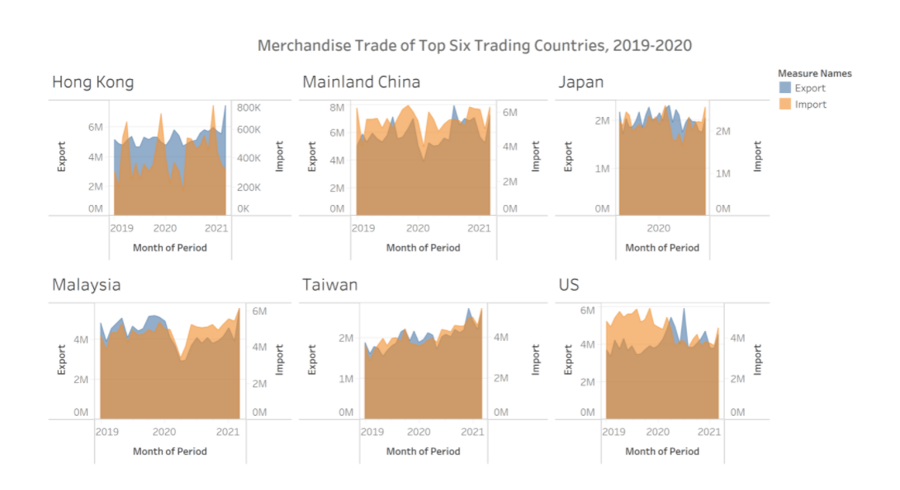
**Context**

To show the volume of international trade over a period of two years from 2019-2020 for six economies of the world namely - Mainland China, US, Malaysia, Taiwan, Hong Kong and Japan.

# 2.	Critiques and suggestions for the original visualization
## 2.1 Clarity
S/N |Critiques|Comments / Suggestions
----|-------------------------------|------------------------
1	|**Graph Title** - The title of the graph mentions ‘Top Six Trading Countries, 2019-2020’ whereas in terms of combined value of export and import for a period of two years, Japan should be replaced by Indonesia to justify ‘top six’. |The title of the graph should not only be clear and concise but more importantly should be correct.
2	|**Use of different scale** – The scale used to plot import and export data, especially in case of Hong Kong is not uniform. Export is in terms of millions and Imports is in terms of thousands. |	This practice leads to gross misinterpretation of the graph and makes the visualization practically redundant.
3	|**Incorrect axis title** – The title of X Axis is ‘Month of Period’ whereas the X Axis label is that of the year. The title of the axis is not in sync with the labels.|	All the titles and the labels of the axis should be in place.
4	|**Data not comparable** – A separate graph for each country makes the comparison across countries difficult and in-turn makes the graph less handy and useful.|	Graph should be designed keeping the key objective in mind.
5	|**Currency of the data is not mentioned** | Incomplete information leads to assumptions and multiple interpretations.
6	|**Graph for Japan is misleading** - While the title of X axis for all the countries shows a timeline for two years, in case of Japan it shows only 2020.| There should be uniformity in the graph, otherwise it may lead to incorrect interpretation and defeat the purpose of visualization.	
7	|**Source of the data not mentioned**	|The graph should state the source of the data for authenticity and clarity.

## 2.2 Aesthetics
S/N	|Critiques |Comments / Suggestions
----|-------------------------------|------------------------
1	|**Different fonts** – Three different fonts have been used in the graph for the Axis Title, Axis Label and Graph Title.|	The text used in the graph should belong to the same font family. Moreover, the font should not be fancy and should be easy to read and understand.
2	|**Multiple axis for value** – Two separate axis to represent export and import.	|The use of two separate value axis makes the graph complicated, confusing, and clumsy. The graph should be clear and pleasing to the eye.
3	|**No tick marks in the X and Y Axis**  – There are no tick marks in-spite of representing continuous data.| In case of continuous data, tick marks makes the graph easy and quick to comprehend.	

# 3.	Alternate Graphical Presentation
## 3.1 Proposed Design
The rough draft of proposed graphical presentation for the dataset is

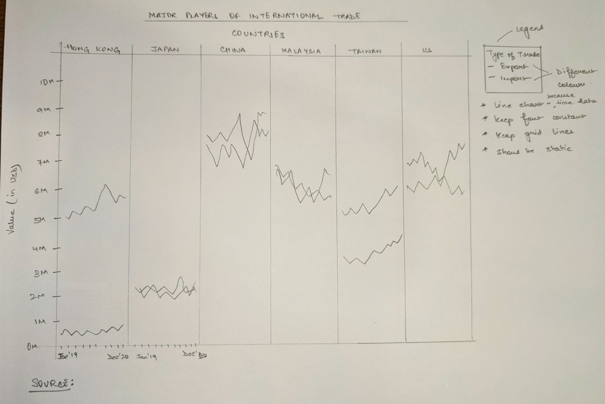


## 3.2 Advantages of the design
S/N	| Aspect |	Issue | Action Taken
-----|--------|-------------------|-------------------------------
1	| Clarity	|Graph Title	|Modified to ‘Major Players of International Trade’
2	| Clarity	|Different Scale in the same graph	|Uniform scale for both Imports and Exports
3	|Clarity	|Title of Y Axis	|Removed as the X axis label depicts the timeline
4	|Clarity	|Cross-country data comparison is difficult |One single graph with data of all the countries instead of six separate graphs
5	|Clarity	|Currency not mentioned	|The title of Y axis to highlight the currency
6	|Clarity	|Graph for Japan is misleading	|The new graph resolves the issue
7	|Clarity	|Source of the data not mentioned	|Source mentioned and data link provided
8	|Aesthetic	|Different usage of fonts	|Formatting done to ensure uniformity
9	|Aesthetic	|Dual axis for value	|One axis to represent both import and export values
10	|Aesthetic	|No tick marks in the X and Y Axis	|Tick marks included in both the axis for better interpretation of the data

# 4.	Proposed Visualization

The remake of the given visualization can be accessed [here](https://public.tableau.com/app/profile/vertika.poddar/viz/DataVizMakeover1-MajorPlayersofInternationalTrade/Dashboard1)

# 5.	Data Visualization Steps

## 5.1 Data Preparation

i.	MS Excel has been used to prepare the data for the purpose of visualization. There are three sheets in the Excel Workbook – 
  +	Content – Remove as not relevant to our work.
  +	T1 – Contains Import Data, rename to ‘Import Data’
  +	T2 – Contains Export Data, rename to ‘Export Data’.
All the steps below has been applied to both ‘Import Data’ and ‘Export Data’ sheets.
ii.	As the time frame is Jan’19 - Dec’20 delete all the other columns of both the Import and Export data.
iii.	Clean the data further removing redundant rows from the top and bottom.

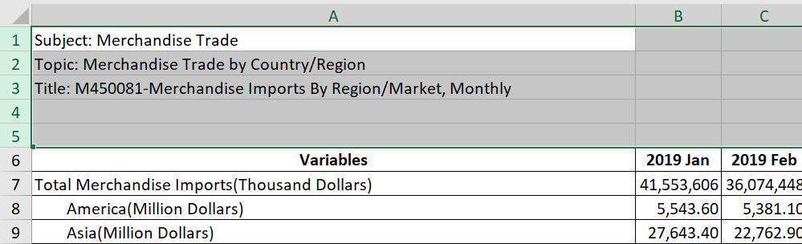{width=100px}


iv.	As the visualization is concerned with six countries namely – Hong Kong, Mainland China, Japan, Malaysia, Taiwan and US, filter the dataset accordingly to select and keep only these six countries. Remove the rest of the countries from the base file.

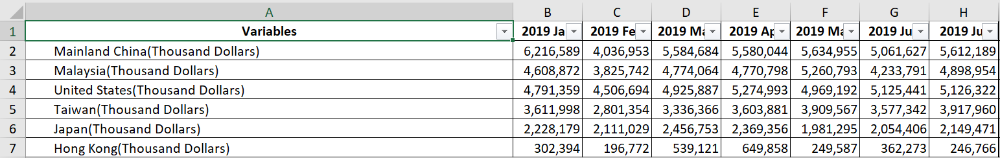{width=300px}


v.	Make the data presentable by deleting the suffix “(Thousand Dollars)” from the name of the countries. The final dataset looks as:

{width=300px}


## 5.2	Data Visualization
i.	Import the file is in Tableau.

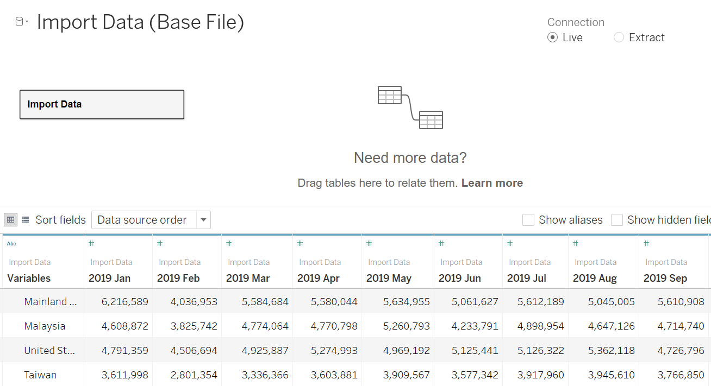{width=80%}


ii.	To Pivot the data – select all the columns with the time period (Jan’19 – Dec’20). Right click and select “Pivot”.


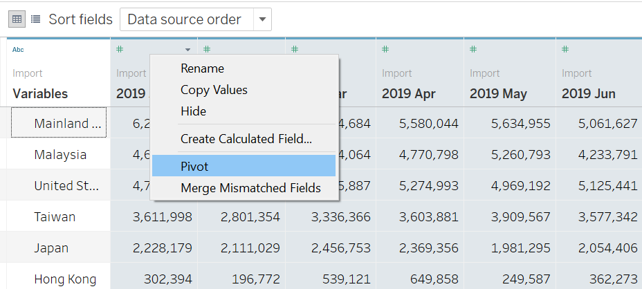{width=60%}


iii.	Rename the headers – Rename ‘Variables’ to ‘Countries’, ‘Pivot Field Names’ to ‘Period’ and ‘Pivot Field Values’ to ‘Import’/’Export’


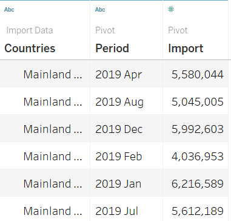{width=30%}


iv.	Change Data Type of the ‘Period’ from ‘String’ to ‘Date’


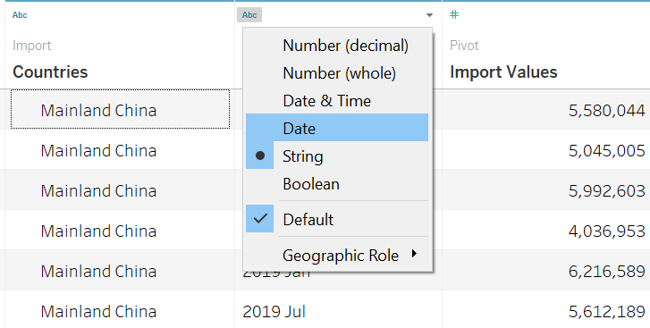{width=50%}


v.	Link the two datasets – ‘Import Data’ and ‘Export Data’ by using the common fields of ‘Countries’ and ‘Period’


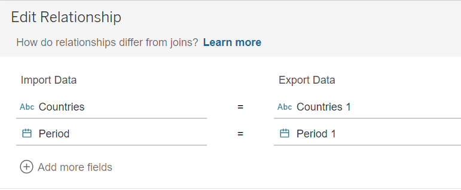{width=70%}


vi.	Drag ‘Countries’ and ‘Period’ to Columns and ‘Measure Value’ to Rows


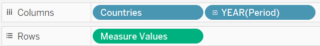{width=70%}


vii.	Expand ‘Year(Period)’ tab to ‘Month(Period)’ and click on the tab to change the format to ‘Month’

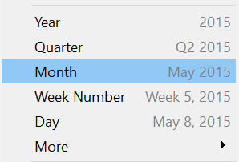{width=30%}


viii.	 Drop ‘Measure Names’ to the ‘Color’ side panel to differentiate the Export and the Import values


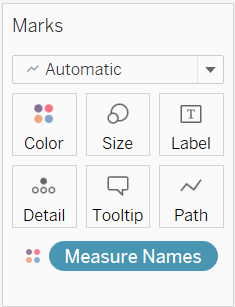{width=30%}


ix.	This is how the base graph will look like

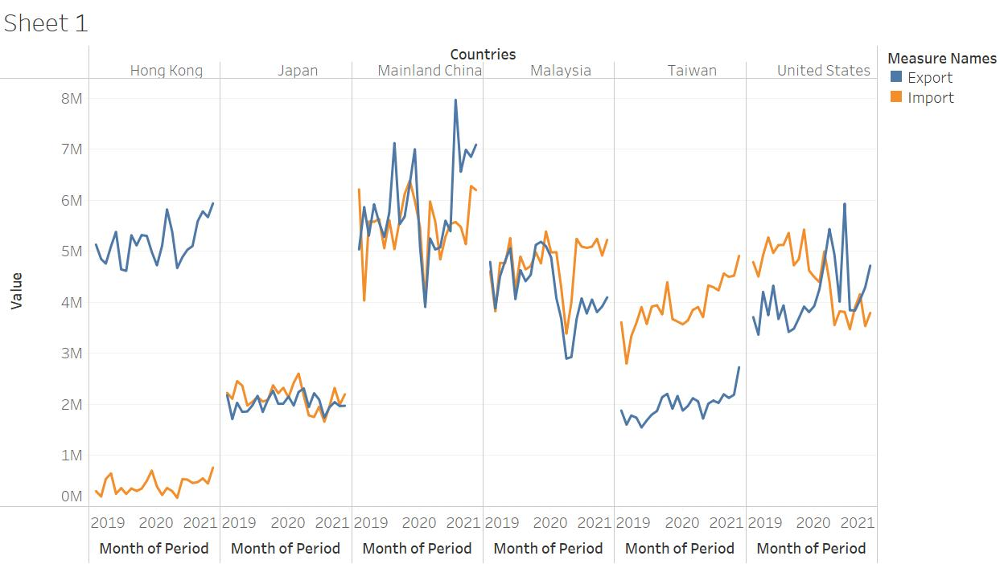{width=200px}
 

x.	The title of Y Axis is relevant as the timeline is clearly shown. To remove the title, right click on the Y axis and select ‘Edit Axis’. Delete the title under ‘Axis Titles’


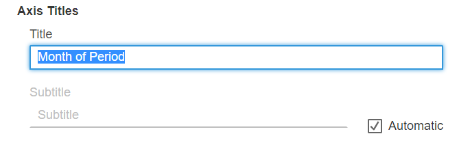{width=70%}


xi.	 In a similar way, edit the title of the X Axis


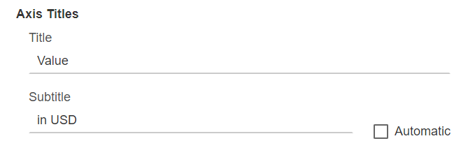{width=70%}


xii.	Give an appropriate title to the graph, change it to ‘Major Players of International Trade’
xiii.	Change the title of the legend from ‘Measure Names’ to ‘Type of Trade’

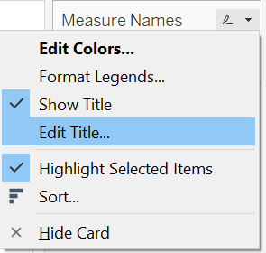{width=30%}


xiv.	Format the title and label of the axis to ensure that there is similar font across. 
xv.	The data on both the X and the Y Axis is ‘continuous’ in nature, hence both the axis is modified to incorporate ‘tick marks’ for easy and better interpretation. For this, right click on the axis and select ‘Edit Axis’.


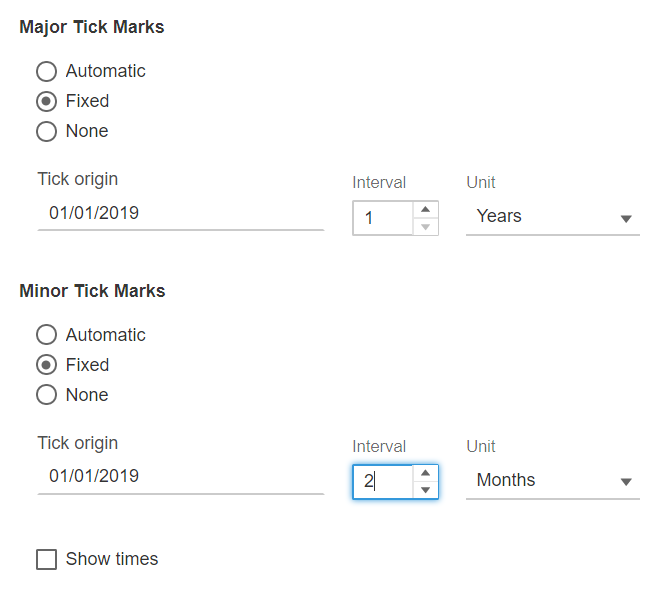{width=50%}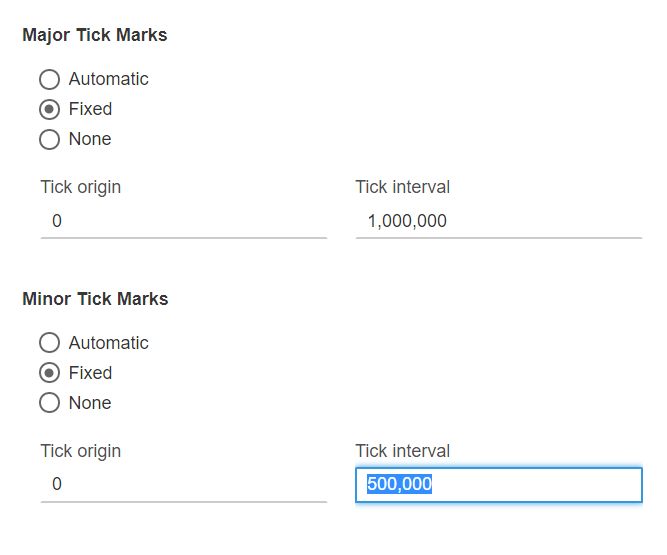{width=50%}


xvi.	Add a reference line (right click on the axis and select 'Add reference line') to show the average value trade of the six countries – this will make comparison easy.

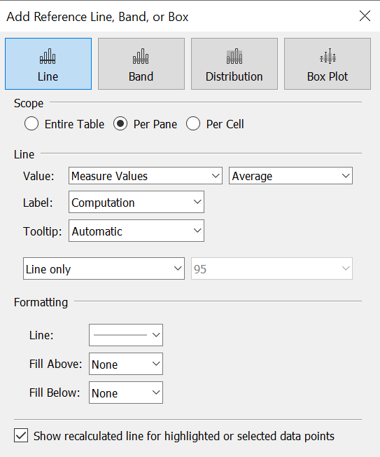{width=40%}

xvii.	Format the title with grey background and white text.
xviii.	Move the worksheet to the dashboard.
xix.	Use ‘Text’ under ‘Objects’ to add ‘Source’ and ‘Author’.

# 6.	Key Observations

i.	The impact of COVID – 19 is clearly evident in countries like Mainland China, Malaysia and United States. From the graph we can see that there is a dip in both exports and imports of these countries.
ii.	While in five countries value of exports is dominated by the value of imports, or are at par, Hong Kong is a big exception. Hong Kong is primarily into exports. The value of imports made by Hong Kong comprises of around 10% of the value of exports. There is a wide gap (of approximately $5 million) in the exports and imports.
iii.	Towards the second half of 2020, exports showed a significant improvement both in China and in US.

# 7.	References

i.	[MakeoverMonday]( https://www.makeovermonday.co.uk/blog/)
ii.	[Storytelling with data]( https://www.storytellingwithdata.com/blog)
iii.	[Data Visualization: Clarity or Aesthetics?]( http://dataremixed.com/2012/05/data-visualization-clarity-or-aesthetics/)


