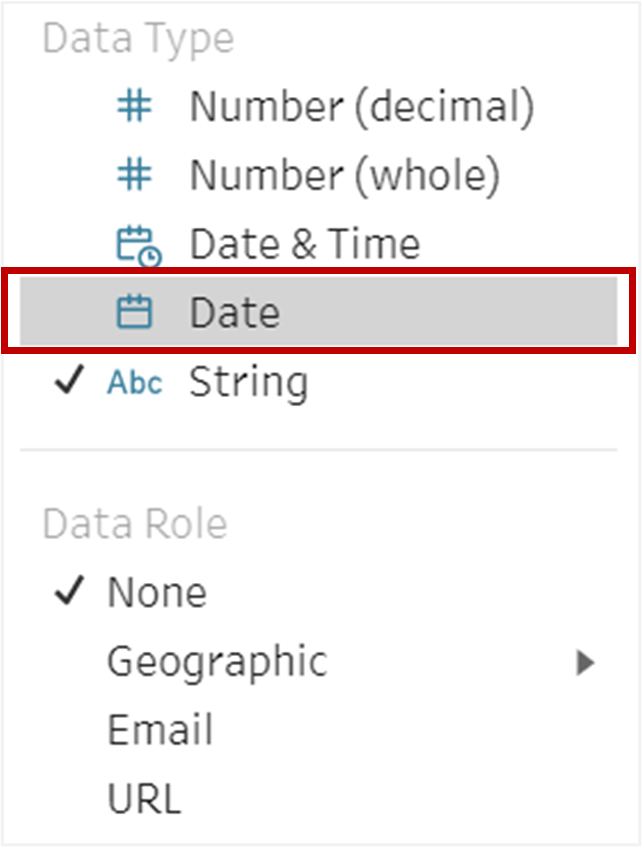

```{r setup, include=FALSE}
knitr::opts_chunk$set(echo = FALSE)
```
# 1.	Background
The original visualization is created from the data provided by the Department of Statistics, Singapore (DOS). The data is available under the sub-section of [Merchandise Trade by Region / Market](https://www.singstat.gov.sg/find-data/search-by-theme/trade-and-investment/merchandise-trade/latest-data)


**Context**

To show the data of Singapore’s international trade for a period of ten years from 2011-2020 by using graphical design principles and interactive techniques.

# 2.	Critiques and suggestions for the original visualization
## 2.1 Clarity
S/N |Critiques|Comments / Suggestions
----|-------------------------------|------------------------
1.	|**Graph Title is missing** – There is no title given to the visualization. A graphical representation is always regarded as incomplete in the absence of a well worded title.	|The graph must have a proper title which sets the true context of the visualization.
2.	|**Timeline is not indicated** – There is no information available in the graph which indicates the period for which this representation is designed.|	Time period is one of the key metrics which must find its mention in the graph. In the absence of which the entire intent and message of the graph becoming meaningless as the reader is unable to connect with the data.
3.	|**Basis of selection of trading partners is not mentioned** – The graph depicts the details of ten trading partners, but the basis of selecting these partners finds no mention in the graph or the attached comments.	|In order to provide a complete and a clear picture to the reader, all the assumptions and basis should be mentioned in the visualization.
4.	|**Terms are confusing** – Some specific terms such as ‘Net Importers’ and ‘Net Exporters’ have been used in the visualization, although these have been defined in the graph, the choice of words create a confusion in the reader’s mind. |	The terms used should be clear and avoid any scope of confusion or misunderstanding.
5.	|**Data labels lack information** – Data labels have been used to identify bubbles in the graph. While they effectively communicate the name of the trading partner but they lack the details associated with the figures. This makes those numbers meaningless. It leaves a room of interpretation as to what key metric those numbers are trying to communicate to the reader.  |	All the labels used in the graph must be appropriately tagged and named to avoid any confusion and deliver the intended information.
6.	|**Unit of measure and currency missing **– Neither the unit of measure is clear from the graph nor the currency is indicated.	|The variables used in the graph must always specify the unit of measure and the currency where the value is monetary.
7.	|**Unable to identify the value of exports and imports** – In the absence of any label or tooltip on the data points we are unable to get the exact value of export or import made to the trading partners. 	|The data points should be enhanced to either include a label or a tooltip to provide complete information.
8.	|**No information on Balance of Trade **– The graph provides no information on the balance of trade.	|Since the graph talks about international trade, the information on Balance of Trade is a key metric and should form part of the visualization.
9.	|**Inappropriate commentary** – There is a comment in the visualization which talks about Singapore’s trade with Mainland China and United States for the year 2009 and 2006 respectively. Without any context or background or reference for this specific mention, this comment seems inappropriate and the intent of communication is lost.	|The comment in the graph can be a takeaway or a conclusion with some reference to the background. It should be associated with the chart and there should be a direct link with the text and the contents of the charts. 

## 2.2 Aesthetics
S/N	|Critiques |Comments / Suggestions
----|-------------------------------|------------------------
1.	|**Size of the bubbles** - The size of the circles used to represent the trading partners is too large. As a result, most of the data points are overlapping, like in the case of Malaysia, EU, Republic of Korea. Further, in some of the cases, the centre point of the bubble (white circle) which gives information on ‘Net Importer’ and ‘Net Exporter’ is also not visible.	|In a Bubble Chart the size of the circles should be appropriate so that data points (bubbles) do not completely overlap.
2.	|**Choice of colors** – The trading partners have been colour coded in the graph, this is a *“ChartJunk”* as the use of different colours is merely a distraction and does not give any additional information. Moreover, same shade of color has been used to represent EU and Thailand. This creates a misconception that the two trading partners are related, whereas it is not so.  |	Colors in graphs should not be an element of design only, but more importantly they should be capable of communicating some additional insight about the dataset. Cases where they fail to achieve the goal of communication they render the charts as junks. 
3.	|**No tick marks in both X and Y Axis** -  Even though both X and Y axis are represented by variables which are continuous in nature, tick marks have not been used in the graph. 	|Where the variables are continuous in nature, tick marks are necessary and make the graph easy and quick to comprehend.
4.	|**Inappropriate placement of Axis Title** – Both the X and Y axis title is inappropriately placed towards the end.	|Axis titles should be appropriately aligned and placed at the centre of the axis. This creates visibility and eliminates any ambiguity in interpretation.


# 3.	Alternate Graphical Presentation
## 3.1 Proposed Design
The rough draft of proposed graphical presentation of the dataset is given below:


## 3.2 Advantages of the design
S/N	| Aspect |	Issue | Action Taken
-----|--------|-------------------|-------------------------------
1.	|Clarity	|Graph Title is missing 	|Appropriate Title – “Decoding the Decade of International Trade (2011 – 2020) assigned to the graph.
2.	|Clarity	|Timeline is not indicated 	|The graph title provided addresses this issue.
3.	|Clarity	|Basis of selection of trading partners is not mentioned | 	Ranks assigned to the trading partner on the basis of the volume of ‘Total Trade’.
4.	|Clarity	|Terms are confusing 	|Terms are simplified and their definition is also provided.
5.	|Clarity	|Data labels lack information 	|Tooltips are accordingly modified to include complete information.
6.	|Clarity	|Unit of measure and currency missing 	|Axis Title now includes both currency and the corresponding unit of measure.
7.	|Clarity	|Unable to identify the value of exports and imports  |	On hovering over the bubbles the tooltips provide the details also on clicking the bubbles reference line is generated which gives the exact data on these measures.
8.	|Clarity	|No information on Balance of Trade 	|The dashboard has separate graphs to study the trend of Balance of Trade and also to make comparison with other trading partners.
9.	|Clarity	|Inappropriate commentary 	|Data which is irrelevant and has no context is removed from the dashboard.
10.	|Aesthetic	|Size of the bubbles 	|The size of the bubbles is appropriately adjusted to avoid overlapping and provide a clear visualization.
11.	|Aesthetic	|Choice of colours	|The bubble chart is designed using two color tones. Blue represents excess of Exports over Imports and Red represents excess of Imports over Exports
12.	|Aesthetic	|No tick marks in both X and Y Axis 	|Tick marks included where axis represents continuous variables for better interpretation of the data
13.	|Aesthetic	Inappropriate placement of Axis Title 	|Axis Title has been appropriately aligned and placed in the centre for better clarity.

*Moreover, the Bubble chart has been animated and the entire dashboard has been made interactive to enable analysis of data from multiple perspectives.*

# 4.	Proposed Visualization

The remake of the given visualization can be accessed [here](https://public.tableau.com/app/profile/vertika.poddar/viz/DataVizMakeover2-DecodingtheDecadeofInternationalTrade/Dashboard1)


# 5.	Data Visualization Steps

## 5.1 Data Preparation

1.	Tableau Prep Builder 2021.1.3 has been used to prepare the data for the purpose of visualization.
2.	Open the Tableau Prep Builder software and click on ‘Add Connections’ icon on the left hand side of the screen.

{width=30%}

3.	From the options under ‘To a File’ select ‘Microsoft Excel’.

{width=50%}

4.	Navigate to the folder path where the base data downloaded from the Singstat website has been stored. Open the file.

{width=60%}

5.	Click on the ‘Use Data Interpreter’ option and rename the sheets T1 and T2 as ‘Imports’ and ‘Exports’ respectively.

{width=30%}

6.	For cleaning both the files, add a ‘Clean Step’ to each of them.

{width=30%}

7.	Under the ‘Clean Step’ split the ‘Variables’ using ‘Automatic Split’ and rename the ‘Variables’ as ‘Country’ for both ‘Imports’ and ‘Exports’ file. Keep only this modified column and ‘Remove’ the rest.

{width=40%}

8.	After this add ‘Pivot’ option to both the files. Select all the months from ‘Fields’ and drop it to the ‘Pivoted Fields’ panel.

{width=30%}

9.	Change the format of ‘Pivot1 Names’ and ‘Pivot2 Names’ to ‘Date’. Further rename them to ‘Year’ and their corresponding ‘Pivot1 Values’ and ‘Pivot2 Values’ to ‘Import Values’ and ‘Export Values’ respectively.

{width=30%}

10.	Join the two datasets with ‘Country’ and ‘Year’ as join clauses and ‘full’ as the join type.

{width=60%}

11.	Add a ‘Clean Step’ again to ‘Merge’ the two columns of ‘Country’ and ‘Year’. To merge the fields simply drag and drop one of them on the other.

{width=50%}

12.	Since the base data is in thousand dollars, create a calculated field. Right click and select ‘Custom calculation’ from ‘Create calculated field’ and multiply both the ‘Import Values’ and the ‘Export Values’ by 1000. Remove the original ‘Import Values’ and ‘Export Values’. 

{width=70%}

13.	Save the output and name the file as ‘Singapore International Trade data’

{width=30%}

14.	Use Tableau Desktop, drag and drop the file to ‘Singapore International Trade data’ on Tableau Desktop to establish a connection and start with data visualization.

{width=90%}

## 5.2	Data Visualization

1.	Since the dataset provides information only on the export and the import values, compute ‘Total Trade’ and ‘Balance of Trade’. For this, use the ‘Create Calculated Field’ option under the ‘Analysis’ tab.

{width=30%}


2.	Create a field for ‘Total Trade’ by summing up ‘Exports’ and ‘Imports’


{width=60%}


3.	Next, create a field for ‘Balance of Trade’ by subtracting ‘Imports’ from ‘Exports’.

{width=60%}


4.	To create groups of countries, right click on the ‘Country’ dimension > Create > Groups. 

{width=40%}


5.	Create a group of countries that belong to ‘European Union’

{width=40%}


6.	To rank the trade partners by the volume of ‘Total Trade’, create another calculated field ‘Rankings’ by using the formula given in the screenshot:

{width=60%}


7.	The period of analysis is from the year 2011-2020. To filter this out, drag ‘Years’ to the ‘Filter’ section. From the dialogue box that pops up, select ‘Years’ and click on ‘Next’.


{width=30%}


8.	From the next window that opens up, select all the years from 2011-2020. Click on Apply > OK.


{width=40%}


9.	Next drag and drop ‘Exports’ and ‘Import’ to Columns and Rows respectively. And ‘Country (group)’ to Details.

{width=80%}


10.	Select ‘Circles’ under ‘Marks and then move ‘Total Trade’ to ‘Size’, ‘Balance of Trade’ to ‘Color’ and ‘Country (group)’ to ‘Label’. Under ‘Size’ modify the size of the bubbles.

{width=20%}


11.	Change the view from ‘Standard’ to ‘Entire view’

{width=50%}

12.	To animate the bubble chart, drag and drop ‘Years’ to ‘Pages’ and select ‘Animations’ from the ‘Format’ tab. From the ‘Animations’ pane select ‘On’.

{width=50%}


13.	Make the sheet more dynamic by giving an option to select the display of Top N countries by ‘Total Trade’. To do this use the calculated field ‘Rankings’ and drop it to ‘Filters’ pane. Right click on it and select ‘Country (group)’ under ‘Compute using’ option.

{width=40%}


14.	From the dialogue box that opens, select the initial value to ‘10’ under ‘Range of values’.

{width=60%}


15.	Right click on the X Axis for ‘Exports’ and select the option ‘Add Reference Line’.

{width=20%}


16.	Set the options as given in the screenshot below. Repeat the same steps on the Y Axis for ‘Imports’. 

{width=40%}


17.	Edit the colours for the ‘Balance of Trade’ to two shade colours as given in the screenshot below. This is done because the current shaded pattern does not convey any additional communication from the graph.

{width=50%}


18.	Add ‘Exports’ and ‘Imports’ to ‘Tooltip’ and then right click to select ‘Format’. From the ‘Pane’ option select ‘Currency (customs)’. Modify the ‘Display units’ to ‘Billions’, ‘Prefix’ to ‘S$’ to denote Singapore Dollars and ‘Negative values’ as given in the below screenshot. Repeat the steps for ‘Imports’, ‘Total Trade’ and ‘Balance of Trade’.

{width=50%}


19.	Create additional calculated fields ‘Net Exports’ and ‘Net Imports’ as given below. Format these two fields similar in the step above.

{width=60%}{width=60%}


20.	Use the above fields to modify the ‘Tooltip’ as given in the screenshot:

{width=60%}


21.	Modify both the X and Y Axis as given below:

{width=40%}

22.	To modify the background and to sync it with the animation, right click on the chart area > Annotate > Area.


{width=30%}


23.	Edit the annotation as below. Further format the box, by changing the ‘Shading’ of the box to 0%.

{width=60%}


24.	Further use ‘Annotate’ to divide the chart area into four quadrants as below:
•	Top Players – High Export, High Import
•	Leading Customers - High Export, Low Import
•	Emerging Players - Low Export, Low Import
•	Leading Suppliers - Low Export, High Import

25.	Hide the title and modify the filters to make the sheet more user friendly and rename the sheet as ‘Bubble Plot’.
26.	A snapshot of the bubble graph is attached below:

{width=100%}


27.	Now go to a new sheet to create a line graph to show the trend of the ‘Balance of Trade’ of the trading partners for the decade.
28.	As in the case of the ‘Bubble Plot’ use the ‘Year’ and the ‘Rankings’ in the ‘Filters’ pane. 
29.	Drag and drop ‘Year’ to Columns and ‘Balance of Trade’ to Rows. Add ‘Country (group) to both ‘Detail’ and ‘Color’ field. Also add the calculated field ‘Net Exports’ and ‘Net Imports’ to ‘Tooltip’. Modify the ‘Tooltip’ as below: 

{width=60%}


  


30.	Work in aesthetics similar to the ‘Bubble Plot’ sheet and rename this sheet as ‘Line Chart’. The graph will look similar to the screenshot below: 


{width=90%}


31.	Now go to a new sheet, to create a bar and a line graph showing the trend of ‘Exports’, ‘Imports’, ‘Total Trade’ and ‘Balance of Trade’ over a period of ten years.
32.	Create a new field to assign negative values to all the imports.

{width=60%}


33.	Refer to the screenshot below, to replicate a bar chart. Exports / Imports have been represented by bars and Balance of Trade by a line graph.

{width=90%}


## 5.3.	Designing the Dashboard

1.	 Use the Dashboard tab, drag all the three sheets – ‘Bubble Plot’, ‘Line Chart’ and ‘Bar Chart’ to the dashboard space.
2.	Use ‘Text’ under ‘Objects’ to give appropriate title, add source, author and notes relevant to the graphs.
3.	Keep the ‘Year’, ‘# Top Trading Partners’ and ‘Country’ filters to enhance the useability of the dashboard by making it interactive.
4.	While the ‘Year’ and ‘#Top Trading Partners’ filter is only for the Bubble plot, the ‘Country’ filter should work on all the graphs. For this go to the tab ‘Bubble Plot’ and right click on the ‘Country’ filter > Apply to Worksheets > All Using This Data Source.

{width=50%}


5.	Now the ‘Bubble Plot’ has to be linked to the Line and the Bar Graphs in such a way, that upon selecting the bubbles of the countries, the line and bar graphs only display the trends of those selected bubbles only. For this click on the bubble plot and select the filter icon that gets displayed on the upper right hand corner of the chart.
6.	Next under the ‘Dashboard’ tab select ‘Actions’. Then edit the filter options as shown in the screenshot below:


{width=40%}


7.	Use the ‘image’ object to place the flag of Singapore. The Dashboard is ready for analysis! 


# 6.	Key Observations

1.	**No major change in the ‘Top 10 Trading Partners’** - The composition of the ‘Top 10 Trading partners’ in terms of the volume of ‘Total Trade’ has mostly remained the same over the period of 10 years. On observing the chart of 2011 and 2020 we see that only India has been replaced by Thailand.

{width=90%} {width=90%}


2.	**Change in the volume of Trade** Although the major players have somewhat remained constant, the volume of trading activities with them has undergone a significant change.

+	From a level of below average trading activities back in 2011 Taiwan has emerged as a leading supplier in 2020. As a matter of fact, in the year 2020 the highest imports were done from Taiwan. This can also be further supported from the graph below, where the graph of ‘Balance of Trade’ for Taiwan is downward sloping. 

{width=70%}


+	Exports to Indonesia has drastically reduced during the period of ten years. There was a peak in the year 2018, but post that it has been on a declining trend. 

{width=70%}


3. **Change in the nature of Trade** – For some major players, the nature of trading activities has taken a U turn, that is if the Balance of Trade was positive in the early 2011 it has become negative in the recent years and vice versa.

+	In 2011, highest exports was done to Malaysia, but now in 2020 the value of imports from that country exceeds exports.

{width=70%}


 
+	Likewise in the case of United States, in 2011 Singapore use to Import more that Exports but now for this market, the value of exports exceeds the value of Imports.  

{width=70%}


# 7.	References

+ [Best Practices for Effective Dashboards](https://help.tableau.com/current/pro/desktop/en-us/dashboards_best_practices.htm) 

+ [What is a bubble chart?](https://www.storytellingwithdata.com/blog/2021/5/11/what-is-a-bubble-chart)

+ [Hans Rosling: The best stats you have even seen](https://www.ted.com/talks/hans_rosling_the_best_stats_you_ve_ever_seen )

+ [ISSS608: Visual Analytics – Lesson 2](https://isss608.netlify.app/lesson/lesson02/lesson02-designing-graphs-to-enlighten#28) 


