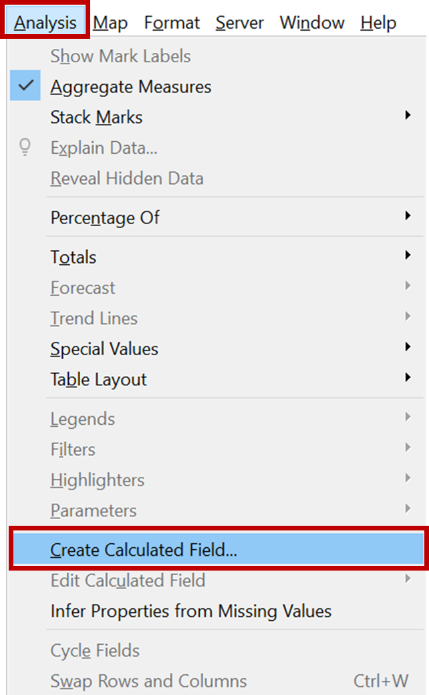
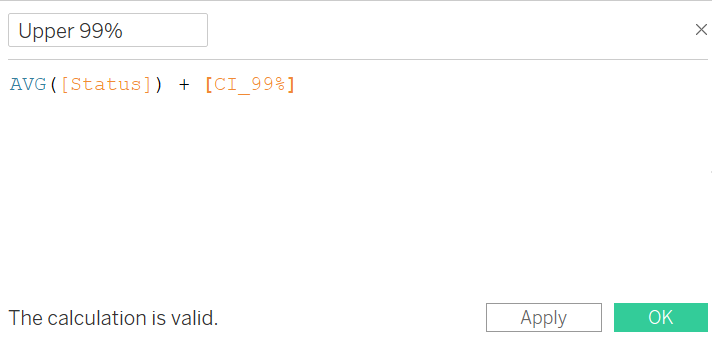

```{r setup, include=FALSE}
knitr::opts_chunk$set(echo = FALSE)
```

# 1.	Background

The original visualization is created from the data provided by the DKI Jakarta Provincial Government. The data is available under the sub-section of [Open Data Covid-19 DKI Jakarta Province.](https://riwayat-file-covid-19-dki-jakarta-jakartagis.hub.arcgis.com/)


**Context**

To support the news write-up of the latest development in DKI Jakarta with respect to Covid - 19 through two visual graphics. 


# 2.	Critiques and suggestions for the original visualization
## 2.1 Clarity
S/N |Critiques|Comments / Suggestions
----|-------------------------------|------------------------
1. |**Type of graph not appropriate** – The two charts are attempting to visualize uncertainty, dot plots and bar charts and not best graphs for such representations. | Two most commonly used approaches to visualize uncertainty are error bars and confidence bands. 
2. |**Missing information on Confidence Interval and Margin of Error** – The graphs is trying to convey data using the statistical approach. However, no information on the level of confidence interval and margin of error is mentioned anywhere in the graph. | The graphs should give a complete picture of the data being represented.
3. |**Losing a lot of information from the data** – The dataset contains a lot of data points pertaining to Covid up-to a sub-district level, but such information is not highlighted in the present graphs. | The graphical representation should give a clear and truthful presentation of data.
4. |**Graph title not in sync with the chart** – The tittle of the first graph is “Top five districts with the highest number…”, but the visualization captures the data of all the districts of DKI Jakarta. | The graph must have a proper title which sets the true context of the visualization.
5. |**Source of the data not mentioned** | The graph should state the source of the data for authenticity and clarity.

## 2.2 Aesthetics
S/N	|Critiques |Comments / Suggestions | Image
----|-------------------------------|------------------------|-----------------------
1. |**Annotations overlap data points** – The placement of the text annotation used to identify top 5 districts is done in such a way that it overlaps the data points, which makes it difficult to interpret the graph. | Annotations if used in graphs should be properly aligned to avoid overlapping.| {width=70%}
2. |**Y Axis labels of the first graph are not legible** – All the districts has been mapped in this graph, but the orientation and the size makes it difficult to read and use the visualization. | The size of the labels and its placement should enhance the usability of the graph. | {width=50%}
3. |**Y Axis title of the first graph is incomplete** | Axis titles should be appropriately aligned and placed at the centre of the axis. This creates visibility and eliminates any ambiguity in interpretation.
4. |**No tick marks in the X Axis**  – There are no tick marks in-spite of representing continuous data in both the visuals.| In case of continuous data, tick marks makes the graph easy and quick to comprehend.

# 3.	Alternate Graphical Presentation
## 3.1 Proposed Design
The rough draft of proposed graphical presentation of the dataset is given below:


## 3.2 Advantages of the design
S/N	| Aspect |	Issue | Action Taken
-----|--------|-------------------|-------------------------------
1. |Clarity | Choice of graph | Error plots used to visualize uncertainty
2. |Clarity | Missing information on Confidence Interval and Margin of Error | Tooltips appropriately mention the information for better interpretation
3. |Clarity | Losing a lot of information from the data | The two visualizations are interactive which gives information on all the status given in the dataset
4. |Clarity | Graph title not in sync with the chart | Appropriately modified
5. |Clarity | Source of the data not mentioned | Source mentioned and data link provided
6. |Aesthetic | Annotations overlap data points | No issue in the revised visuals
7. |Aesthetic | Y Axis labels of the first graph are not legible | Size adjusted accordingly to increase visibility
8. |Aesthetic | Y Axis title of the first graph is incomplete | Modified and resolved in the new visual
9. |Aesthetic | No tick marks in X Axis | Tick marks included in for better interpretation of the data

# 4.	Proposed Visualization

The remake of the given visualization can be accessed [here](https://public.tableau.com/app/profile/vertika.poddar/viz/DataVizMakeover3_16272098007240/Dashboard1)


# 5.	Data Visualization Steps

## 5.1 Data Preparation

1. Tableau Prep Builder 2021.1.3 has been used to prepare the data for the purpose of visualization.
2.	Open the Tableau Prep Builder software and click on ‘Add Connections’ icon on the left hand side of the screen.

{width=30%}

3.	From the options under ‘To a File’ select ‘Microsoft Excel’.

{width=50%}

4.	Navigate to the folder path where the base data downloaded from the *'Open Data Covid-19 Provinsi DKI Jakarta'* website has been stored. Open the file.

5. Click on the ‘Use Data Interpreter’ option

6. Use the file named 'data', add a clean step to it

{width=30%} 

7. Clean the dataset to remove all the irrelevant columns. Remove all the columns except the following:
*'Nama_provinsi', 'nama_kota', 'nama_kecamatan', 'nama_kelurahan',  'POSITIF', 'Dirawat', 'Sembuh', 'Meninggal', 'Self Isolation'*

8. To remove the 'null' data, right click and click 'exclude'.

{width=70%} 

9. The name of the columns of the dataset is in Indonesian, *google* them to find and replace with the corresponding English names. *(Refer the below table)*

Indonesian	| English 
--------|---------
Nama_provinsi | Province
nama_kota | City
nama_kecamatan | District
nama_kelurahan | Sub-district
POSITIF | Positive
Dirawat | Treated
Sembuh | Recovered
Meninggal | Death

10. Save the output and name the file as ‘Indonesia_Covid Data’

{width=30%}

11. Use Tableau Desktop, drag and drop the above file on Tableau Desktop to establish a connection and start with data visualization.


## 5.2	Data Visualization

1. Create a parameter - 'Status'. For this, right click on the Data Pane to select 'Create Parameter'.

{width=30%}

2. Create the parameter 'Status'. To show the parameter, right click on 'Status', select 'Show Parameter', the parameter will now appear on the right hand side of the screen.

{width=50%}

3. Use the ‘Create Calculated Field’ option under the ‘Analysis’ tab.

{width=30%}

4. Create a calculated field  -Number of records

{width=60%}

5. Create a calculated field  - Status

{width=60%}

6. Create a calculated field  - Standard Error

{width=60%}

7. Create z scores for 95% and 99% confidence interval

{width=50%}  {width=50%}

8. Create CI 95% and CI 99%

{width=50%}  {width=50%}

9. Lower and Upper CI 95%

{width=50%}  {width=50%}  

10. Lower and Upper CI 99%

{width=50%}  {width=50%}  

11. Drag and drop 'City' to Rows and to Filters pane. Select only the following cities from the filter.

{width=40%}

12. Drag and drop 'Measure Values' to Columns. From 'Measure Values' keep only Upper and Lower 99% and 95% and drop the rest. Further, rearrange the four metrics as shown in the figure below and change the chart type to 'Line'.

{width=100%}

13. Drag and drop 'Measure Names' to Path and to Color.

{width=30%}

14. Assign one color type to the 99%s and another color type to 95%s. Also, use the 'Color' pane to modify the lines and add markers.

{width=20%}

15. Drag and drop 'Status' to Columns and change it to average.

{width=60%}

16. Right click on the x-axis  of new populated graph and select 'Dual Axis' followed by 'Synchnorize Axis' option.

17. Change the chart type to 'Circle' and to increase the size of the circle modify the circle size using the 'Size' panel.

{width=30%}

18. Right click on the 'Avg Status' axis and unselect the 'Show Header' option.

{width=20%}

19. Next change the Y Axis title.

{width=60%}

20. Sort 'City' as shown in the figure

{width=50%}

21. Edit the Measure Value tooltip as shown

{width=60%}

22. Edit the Status tooltip as shown

{width=60%}

23. To remove grid lines, right click on the screen and select format. Select lines option as shown in the figure.

{width=30%}

24. Adjust Tick marks for Y axis as shown below

{width=30%}

25. To remove decimals, right click on Measure Value, select Format and do the formatting as below

{width=50%}

26. To create an error plot for the Districts, first calculate the following fields.

27. Proportion

{width=60%}

28. Standard Error for proportion

{width=60%}

29. Lower and Upper limit 95% (in terms of % and value)

{width=50%}  {width=50%}  {width=50%}  {width=50%}

30. Lower and Upper limit 99% (in terms of % and value) (4)

{width=50%}  {width=50%}  {width=50%}  {width=50%}

31. Rankings

{width=60%}

32. Create a graph for Districts in similar lines discussed for City above, the snapshot of the error plot will is attached below:

{width=100%}

33. Add title to both the charts created.


## 5.3.	Designing the Dashboard

1. Use the Dashboard tab, drag the two sheets – ‘City’ and ‘District’ to the dashboard space.
2.	Use ‘Text’ under ‘Objects’ to give appropriate title, add source, author and notes relevant to the graphs.
3.	Now the ‘City’ chart has to be linked to the 'District' graph in such a way, that upon selecting the plot of the city, the district graphs only display the error plots of selected city only. For this click on the city graph and select the filter icon that gets displayed on the upper right hand corner of the chart.
4.	Next under the ‘Dashboard’ tab select ‘Actions’. Then edit the filter options as shown in the screenshot below:

{width=40%}


The Dashboard is ready for analysis!


# 6.	Key Observations


# 7.	References

+ [Visualizing uncertainty](https://clauswilke.com/dataviz/visualizing-uncertainty.html)

+ [ISSS608: Visual Analytics – Lesson 4](https://isss608.netlify.app/lesson/Lesson04/Lesson04-Fundamentals_of_Visual_Analytics.pdf)

+ [Create Parameters](https://help.tableau.com/current/pro/desktop/en-us/parameters_create.htm)

+ [Understanding the willingness of public for COVID - 19 vaccination based on survey data](https://suyiinang.netlify.app/posts/dataviz_makeover/02_makeover/)


